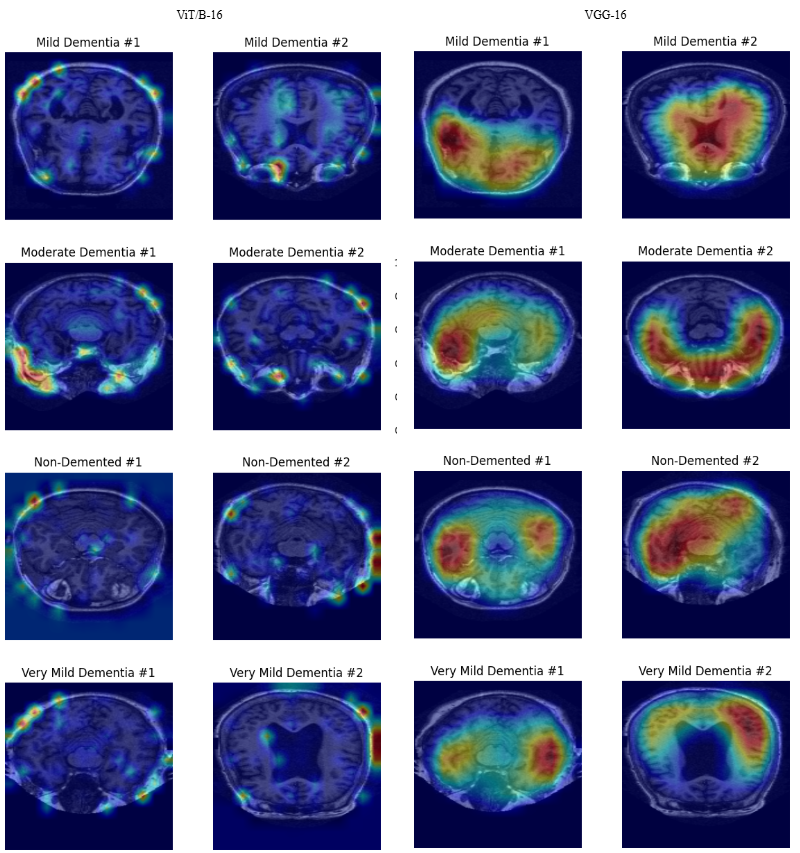

# Vision-Language Model (VLM)-based Alzheimer's Disease Detection

## Overview

This repository contains the codebase for a research project focused on the detection and classification of Alzheimer's Disease (AD) using a fine-tuned Vision-Language Model (VLM), specifically BioMedCLIP. This study explores both binary and multi-class classification scenarios, leveraging multimodal learning and interpretability techniques to achieve high diagnostic accuracy and transparency.

## Abstract

We propose a multimodal approach employing BioMedCLIP, enhanced by domain-specific textual captions and a dedicated classification head, to classify Alzheimer's Disease using MRI imaging data from the OASIS-I dataset. Our model integrates Eigen-CAM for interpretability, providing activation heatmaps highlighting influential neuroanatomical regions. The fine-tuned BioMedCLIP achieves an accuracy of 93.14% (binary classification) and 85.27% (multi-class classification), significantly outperforming baseline methods.

## Contents

- [Directory Structure](#directory-structure)
- [Installation](#installation)
- [Dataset](#dataset)
- [Methodology](#methodology)

  - [Data Preprocessing](#data-preprocessing)
  - [Caption Generation](#caption-generation)
  - [Key Innovations](#key-innovations)
  - [Training Setup](#training-setup)

- [Results](#results)
- [Interpretability (Eigen-CAM)](#interpretability-eigen-cam)
- [Limitations](#limitations)
- [Future Work](#future-work)
- [References](#references)

## Directory Structure

```
Deliverables/
  ├── Deliverable 1 - SOA Survey Presentation.pptx      # Presentation summarizing survey of existing work
  ├── Deliverable 1 - SOA Survey Report.pdf             # Detailed report of survey of approaches
  ├── Deliverable 2 - Dataset Selection.ipynb           # Notebook for dataset selection and exploration
  ├── Deliverable 3 - Baseline Model.ipynb              # Initial baseline model implementation and evaluation
  ├── Deliverable 4 - First Improvement.ipynb           # First improvement over baseline with analysis
  ├── Deliverable 5 - Second Improvement.ipynb          # Second improvement over model with results
  └── Deliverable 6 - Final Paper.pdf                   # Final project report

Data/
  └── filtered_oasis_1.csv                              # Contains metadata information regarding OASIS-I patients

Images/                                                 # Contain images for README.md
```

## Installation

Clone this repository:

```bash
git clone https://github.com/UmerSR/CS-437-Final-Project.git
cd CS-437-Final-Project
```

Run the following command (provided you have installed the dependancies):

```bash
python Deliverables/Deliverable 5 - Second Improvement.ipynb
```

Run all cells to achieve results.

## Dataset

The study uses the [OASIS-I dataset](https://www.kaggle.com/datasets/ninadaithal/imagesoasis), containing approximately 80,000 T1-weighted MRI images of around 400 patients classified into five diagnostic categories:

- Non-Demented
- Very Mild Dementia
- Mild Dementia
- Moderate Dementia

The dataset is preprocessed into standardized 2D slices for direct integration with Vision-Language Models.

## Methodology

### Data Preprocessing

- Selection of the middle axial slice (slice index 130) per patient for consistency and anatomical relevance.
- Image resizing and normalization tailored to BioMedCLIP requirements.

### Caption Generation

- Textual captions generated from demographic and clinical metadata (age, gender, MMSE, eTIV, nWBV, ASF) provided with the OASIS-I dataset.
- Standardized caption structure used consistently across MRI slices of each patient.
- A sample caption is shown as below:

```
Patient ID: OAS1 0033 MR1,
Gender: F, Handedness: R,
Age: 80 years, Education: 4.0,
Socioeconomic Status: 2.0,
MMSE: 29.0 <MMSE Description>,
eTIV: 1323 <eTIV Description>,
nWBV: 0.735 <nWBV Description>,
ASF: 1.326 <ASF Description>,
```

### Key Innovations

#### Baseline Model

BioMedCLIP, a pretrained VLM on 15 million biomedical image-text pairs.

#### Improvement 1

- Fine-tuning BioMedCLIP: Selective unfreezing of last two transformer blocks of BioMedCLIP visual encoder.
- Introduction of dedicated lightweight classification head that concatenates both image and text embeddings from BioMedCLIP:

  ```
  FFN(x) = Linear(1024, 256) → ReLU() → Dropout(0.3) → Linear(256, N)

  where N = number of classes to predict.
  ```

Improvement primarily focuses on binary classification (Alzheimer's vs. Non-Alzheimer's).

#### Improvement 2

- Extension from binary classification to multiclass classification.
- Comparative analysis amongst different vision heads to explore model interpretability: namely, replacing the ViT/B-16 visual encoder within BioMedCLIP with a CNN-based VGG-16 vision head.
- Further use of classification head to improve classification performance.
- Visualizations using Eigen-CAM to explore the spatial attention patterns of both ViT/B-16 and VGG-16 to assess model capability of producing explainable results.

### Training Setup

- Hardware: NVIDIA T4 GPU (Google Colab)
- Optimizer: Adam (learning rate = 1e-5)
- Loss Function: Binary Cross-Entropy (binary) and Cross-Entropy (multi-class)
- Train-Test Split: 80-20
- Epochs: 10

## Results

### Binary Classification

| Model                 | Accuracy   | AUC        |
| --------------------- | ---------- | ---------- |
| Vanilla BioMedCLIP    | 47.71%     | 0.4899     |
| Fine-tuned BioMedCLIP | **93.14%** | **0.9751** |

#### Per-class Classification Results:


### Multi-Class Classification

| Model                            | Accuracy   | AUC        |
| -------------------------------- | ---------- | ---------- |
| Vanilla BioMedCLIP (ViT/B-16)    | 41.09%     | 0.7032     |
| Fine-tuned BioMedCLIP (ViT/B-16) | **85.27%** | **0.9654** |
| Fine-tuned BioMedCLIP (VGG-16)   | 75.19%     | 0.9517     |

#### Per-class Classification Results:


## Interpretability (Eigen-CAM)

- Eigen-CAM used to visualize spatial attention and interpret model predictions.
- Highlights clinically relevant regions such as hippocampal shrinkage, ventricular enlargement, and cortical thinning.
- VGG-16-based models provided more clinically relevant activations compared to ViT-based models.
- See diagram below (left: ViT/B-16, right: VGG-16):



## Limitations

- Limited computational resources constrained broader model comparisons.
- Uniform caption per class rather than individual MRI slices.
- Small dataset size potentially affecting generalizability.

## Future Work

- Explore broader model variants and architectures with different strategies such as full finetuning, rather than selective unfreezing.
- Develop individualized caption generation strategies for each individual MRI slices for a single patient.
- Conduct larger-scale studies for enhanced generalizability and model performance on unseen data.

## References

The detailed list of references is available in the associated research paper included in this repository (`/Deliverables/Deliverable 6 - Final Paper.pdf`).

## Citation

Please cite this repository as follows if you use it in your research:

```
Ashraf, M. A., & Raja, U. (2024). Vision-Language Model (VLM)-based Alzheimer's Disease Detection [Source code]. GitHub. https://github.com/UmerSR/CS-437-Final-Project
```

---

For additional details, please refer to the research paper provided in the repository or contact the authors directly via GitHub issues.
